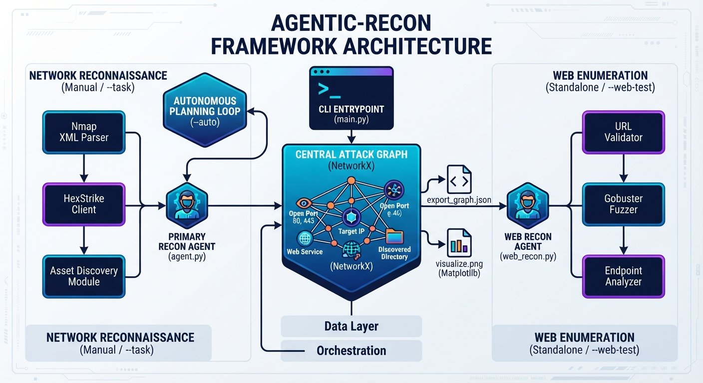

# Autonomous Red Team Recon & Surface Analyzer 🎯🤖

An agentic reconnaissance framework designed for automated, hypothesis-driven attack surface discovery. Unlike traditional, static tool chains that generate noisy outputs, this system dynamically evaluates target context in real time, prioritizes high-value assets, enforces strict scope boundaries, and models the target's attack surface using a directed graph.

---

## 🌟 Key Features

* **Strict Scope Guardrails:** Pre-execution validation layer ensures that no outbound probes or command executions occur against targets outside user-configured domains or IP CIDRs.
* **Deterministic Tool Integration:** Uses safe subprocess wrappers (`shell=False`) to invoke security binaries (e.g., `subfinder`, `httpx`), eliminating command injection vectors while outputting normalized JSON payloads.
* **Graph-Based Attack Surface Modeling:** Built on `NetworkX` to structure discovered entities (Domains, IPs, Ports, Web Apps, Technologies) and their relational edges (`RESOLVES_TO`, `HAS_PORT`, `USES_TECH`).
* **Resilient Execution Engine:** Native error handling and fallback logic allow the agent to gracefully handle missing binaries, timeouts, or rate limits without interrupting the recon cycle.
* **Automated Artifact Generation:** Automatically exports structured Attack Graph JSON data and formatted Executive Markdown reports.

---

## 🏗️ Architecture Overview


---
## 📂 Repository Structure

```text
Agentic-Recon/
├── .gitignore               # Excludes temporary outputs, graph exports, and cache files
├── README.md                # Comprehensive project documentation and usage guides
├── main.py                  # Central CLI dispatcher for routing manual/auto modes
└── src/                     # Core source code package
    ├── __init__.py          # Package initializer
    ├── agent.py             # Core reconnaissance agent controlling task execution
    ├── planner.py           # Autonomous planning loop and task selector
    ├── scope.py             # Target scope parsing, validation, and boundary enforcement
    ├── graph/               # Attack graph topology management and rendering
    │   ├── __init__.py      # Graph package initializer
    │   └── attack_graph.py  # NetworkX topology mapping and graph export utilities
    ├── tools/               # Integration wrappers for external binaries and APIs
    │   ├── __init__.py      # Tools package initializer
    │   ├── hexstrike_client.py # Bridge interface for HexStrike services
    │   └── discovery.py     # Discovery and scanning execution utilities
    └── agents/              # Specialized agent architectures
        ├── __init__.py      # Agents package initializer
        └── web_recon.py     # Standalone web reconnaissance and directory fuzzing agent

```
---
## 🚀 Getting Started
```text
### Prerequisites

* Python 3.9+
* Optional (for live scanning): Pre-installed security binaries on your system `PATH`:
  * Subfinder
  * HTTPX

### Installation

1. **Clone the repository:**
   ```bash
   git clone https://github.com/your-username/agentic-recon.git
   cd agentic-recon
   
   1. Install Python Dependencies
        pip install -r requirements.txt
        
   2. Configure Scope Boundary
        Edit config/scope.json to specify your allowed targets
        
{
  "allowed_domains": [
    "example.com"
  ],
  "allowed_cidrs": [
    "192.0.2.0/24"
  ],
  "blocked_ips": [
    "192.0.2.5"
  ]
}
   ```
---
## 💻 Usage
```text
Run the main execution pipeline against an in-scope target domain:

python main.py -d example.com

Flag,Long Argument,Description,Default
-d,--domain,Required. Target seed domain,N/A
-c,--config,Path to scope JSON file,config/scope.json
-o,--output,Directory for exported reports,reports
```
---

# 🌐 Web Reconnaissance Mode  

In addition to network port scanning and autonomous loops, Agentic-Recon includes a standalone WebReconAgent module. This module gates web directory fuzzing (using underlying tools like Gobuster) away from network-only tasks to map out web server endpoints and attack surfaces safely.

## How it Works
When invoked, the web reconnaissance workflow:

1. Validates and normalizes the target URL.

2. Executes directory fuzzing against the target.

3. Dynamically adds discovered web endpoints as nodes into the AttackGraph, linking them back to the root web service via an EXPOSES_ENDPOINT relationship.

4. Automatically exports the topology to JSON and renders a visual PNG map.


## Usage Example

To run a standalone web recon test against a target:
```text
python main.py --target http://localhost:8000 --web-test --visualize attack_graph.png --export-graph graph_export.json
```
## CLI Parameters for Web Recon

* `--target (or -t)`: The target domain, IP, or base URL (e.g., `http://localhost:8000` or example.com).

* `--web-test`: Enables standalone WebReconAgent directory fuzzing mode.

* `--export-graph`: File path to save the resulting attack graph JSON export (default: graph_export.json).

* `--visualize`: File path to save the generated topology diagram (default: attack_graph.png).

---
## 📊 Sample Output

Upon completion, output files are exported to the `reports/` folder:

* `reports/example.com_attack_graph.json`: Raw node-link graph data structure.
* `reports/example.com_summary.md`: Executive summary table detailing asset counts and strategic findings.

### Executive Summary Snapshot

| Entity Metric | Count |
| :--- | :--- |
| **Total Graph Nodes** | 8 |
| **Total Relationships (Edges)** | 6 |
| **Discovered Domains/Subdomains** | 3 |
| **Resolved IP Addresses** | 1 |
| **Open Service Ports** | 0 |
| **Web Applications Identified** | 2 |

---

## 🛡️ Security & Scope Policy

This tool includes active safety guardrails. Any host, IP, or subdomain resolved during execution that does not explicitly match the constraints declared in `config/scope.json` will be safely blocked prior to tool invocation.

---

## 📝 License

Distributed under the MIT License. See `LICENSE` for details.
---
